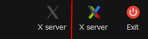

# Installazione di un XSever

- [Installazione di un XSever](#installazione-di-un-xsever)
  - [VcXsrv](#vcxsrv)
  - [MobaXterm](#mobaxterm)
  - [Impostazione delle variabili d'ambiente](#impostazione-delle-variabili-dambiente)
  - [Verifica dell'installazione](#verifica-dellinstallazione)
  - [Risoluzione di problemi](#risoluzione-di-problemi)

> **Verificare la versione di WSL attiva**
>
> La guida varia in base alla versione di WSL installata, assicurarsi di seguire le istruzioni specifiche per la propria versione.
>
> Per verificare la versione installata, lanciare Powershell con permessi da amministratore ed eseguire il seguente comando:
>
> ```powershell
> > wsl -l -v
> ```
>
> Il comando restituirà una tabella con elencate le distribuzioni di Linux installate e la versione di WSL corrispondente.

Tramite WSL è possibile eseguire programmi nativi Linux sulla macchina Windows, ma per poter visualizzare finestre grafiche è necessario utilizzare dei tool aggiuntivi per gestire l'input e l'output grafico. Per farlo vengono solitamente utilizzati degli strumenti noti come server X.
I server X disponibili per Windows sono numerosi; ne elencheremo due, scelti per la loro facilità d'uso e le numerose funzionalità, rispettivamente: [VcXsrv](https://sourceforge.net/projects/vcxsrv/) e [MobaXterm](https://mobaxterm.mobatek.net/).

## VcXsrv

VcXsrv è un software open source per Windows basato su una delle [distribuzioni più note](https://wiki.archlinux.org/index.php/Xorg) del sistema X window. Questo lo rende il software ideale per chi cerca uno strumento semplice per svolgere il solo compito di server X.

1. Scarica [VcXsrv Windows X Server](https://sourceforge.net/projects/vcxsrv/)
2. Installa il software scaricato
3. Avvia lo strumento cercando XLaunch nel menù di start
4. **Se si usa WSL2** assicurarsi di attivare l'opzione "Disable access control".
5. Clicca su Next > per accettare le configurazioni e Finish per avviare il programma

> Individuata la configurazione preferita è possibile salvarla su file dall'ultima scheramta di configurazione. Successivamente sarà possibile usare questo nuovo collegamento per avviare direttamente il server nella confiugurazione memorizzata.

## MobaXterm

MobaXterm è un terminale avanzato per Windows che include un server X, un client SSH e tool di rete aggiuntivi. Molte delle sue funzionalità non erano presenti di default in Windows fino a le ultime versioni del sistema operativo, rendendo tool di questo tipo molto ricercati.

1. Scarica la _Home Edition_ di [MobaXterm](https://mobaxterm.mobatek.net/download-home-edition.html), preferibilmente nella sua _Installer edition_
2. Estrai l'archivio `.zip` scaricato e procedi con l'installazione (sincerarsi di aver effettuato l'estrazione; se si procede all'installazione dalla finestra di anteprima del contenuto dell'archivio si ottiene un errore)
3. Avvia lo strumento cercando MobaXterm nel menù di Start
4. Assicurati che il server X sia in funzione, controllando che l'icona in alto a destra sia colorata.

   

> Con MobaXterm è possibile utilizzare il terminale dell'applicazione per accedere a WSL. Per farlo selezionare con un doppio clic WSL-Ubuntu dal menù session sulla sinistra.

## Impostazione delle variabili d'ambiente

Una volta installato un server X è necessario istruire l'ambiente Linux, che agisce da client X, su dove trovare il server X.
Questo viene fatto modificando la [variabile d'ambiente](https://en.wikipedia.org/wiki/Environment_variable) `DISPLAY`.

**Se si usa WSL1**

Lanciare i comandi seguenti da WSL:

```bash
$ export DISPLAY=:0
$ export LIBGL_ALWAYS_INDIRECT=1
```

**Se si usa WSL2**

Lanciare i comandi seguenti da WSL:

```bash
$ export DISPLAY="$(/sbin/ip route | awk '/default/ { print $3 }'):0"
```

I cambiamenti effettuati rimarranno fino al successivo riavvio di WSL.
Su Ubuntu è possibile fare in modo che le modifiche fatte siano persistenti ad ogni avvio di WSL,  modificando il file `.bashrc`.
Per modificare il file è possibile utilizzare uno dei numerosi editor di testo per terminale presenti nelle distribuzioni Linux (`nano`, `vi`, `emacs`, etc.) con un comando simile al seguente:

```bash
$ nano ~/.bashrc
```

> Il simbolo di ~ (tilde) su Unix è una scorciatoia per indicare il path della cartella home dell'utente attivo. Se non fosse disponibile sulla propria tastiera è possibile sostituirla con il path assoluto `/home/$USER` dove `$USER` è la variabile d'ambiente che contiene il nome dell'utente.

In alternativa, per chi non ha troppa familiarità con il terminale, una volta completata l'installazione di VS Code è possibile aprire il file `.bashrc` da modificare con il comando:

```bash
$ code ~/.bashrc
```

**Se si usa WSL1**

Aggiungere le seguenti righe in fondo al file:

```
export DISPLAY=:0
export LIBGL_ALWAYS_INDIRECT=1
```

**Se si usa WSL2**

Aggiungere le seguenti righe in fondo al file:

```
export DISPLAY="$(/sbin/ip route | awk '/default/ { print $3 }'):0"
export LIBGL_ALWAYS_INDIRECT=1
```

Salvare le modifiche e lanciare il seguente comando per applicare immediatamente:

```bash
$ source ~/.bashrc
```

## Verifica dell'installazione

Per verificare che l'installazione del server sia andata a buon fine potete scaricare da Ubuntu delle applicazioni di esempio con il comando:

```bash
$ sudo apt install x11-apps
```

e provare ad aprire una finestra grafica che visualizza l'ora corrente con il comando:

```bash
$ xclock
```

> **WSL2 richiede dei permessi aggiuntivi**
> Se si usa VcXsrv assicurarsi di aver attivato l'opzione "Disable access control" al lancio.
>
> Se si usa MobaXterm apparirà una finestra di dialogo che chiederà conferma per la connessione.

Se si apre una finestra come la seguente, l'installazione ha avuto successo.


## Risoluzione di problemi

Se una volta lanciato il comando il terminale dovesse sospendersi (non si apre nessuna finestra, non ritorna nessun errore sulla linea di comando, non risulta attivo il prompt), potrebbe esserci un problema dovuto alle impostazioni del firewall di Windows.

Molto probabilmente, la rete a cui si è connessi risulta memorizzata come rete Pubblica. Nel caso in cui questo fosse errato (si sta cioè usando una connessione domestica o la connessione sicura universtaria), è possibile cambiare il profilo di rete andando in Impostazioni > Rete e Internet > Proprietà e selezionare il profilo Privato per la rete attiva.

In alternativa, è possibile cambiare le impostazioni del firewall abilitando il Server X.
Se si utilizza il firewall standard di Windows, Windows Security, è possibile cercare Firewall & Network security nelle Impostazioni e cliccare sul link Allow an app through firewall. Nella finestra che appare, individuare la voce VcXsrv o MobaXterm e abilitare l'applicazione su entrambe i profili di rete.

Alcune librerie grafiche più avanzate possono richiedere particolari requisiti hardware. In caso di errori o lentezza nell'esecuzione è possibile testare diverse configurazioni di avvio del server, abilitando o disabilitando il supporto nativo a opengl o variando la variabile di sistema `LIBGL_ALWAYS_INDIRECT` da 0 a 1. La configurazione ottimale potrebbe variare in base alla versione del sistema operativo e alla scheda grafica installata sulla macchina.

La libreria grafica SFML, in esecuzione, produce un warning `Setting vertical sync not supported` questo è inevitabile con l'uso di WSL e va pertanto ignorato. Non influenzerà il funzionamento del programma.
