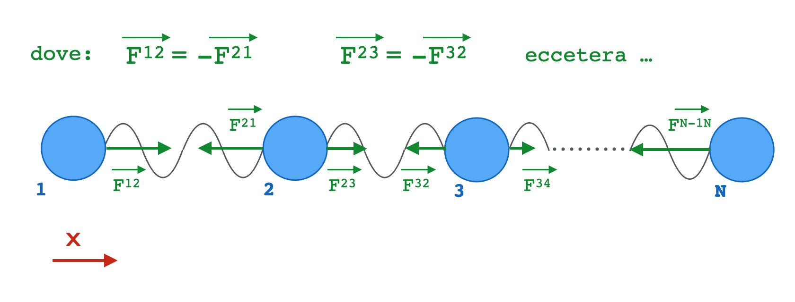

# Lab 5

In questo laboratorio utilizzeremo alcuni concetti appresi durante le lezioni
per sviluppare semplice programma (_toy model_) che calcola, tramite un metodo
di integrazione numerica, l'evoluzione dinamica di un sistema composto da più
punti materiali interagenti.

Durante lo svolgimento, consigliamo di tenere aperte le
[slide](https://github.com/giacomini/pf2021/releases/latest)
 presentate a lezione.

- [Lab 5](#lab-5)
  - [Area di lavoro](#area-di-lavoro)
  - [Obiettivo finale](#obiettivo-finale)
  - [Traduzione del problema in C++](#traduzione-del-problema-in-c)
    - [Primo passo: stato di un punto materiale](#primo-passo-stato-di-un-punto-materiale)
    - [Secondo passo: forza generata da una molla](#secondo-passo-forza-generata-da-una-molla)
    - [Terzo passo: implementazione di `Chain`](#terzo-passo-implementazione-di-chain)
      - [Un semplice modello di integrazione numerica](#un-semplice-modello-di-integrazione-numerica)
      - [Implementazione di `evolve`: prima approssimazione](#implementazione-di-evolve-prima-approssimazione)
      - [Implementazione di `evolve`: versione completa](#implementazione-di-evolve-versione-completa)
  - [Un `main` che utilizza la classe `Chain`](#un-main-che-utilizza-la-classe-chain)
  - [Alcune considerazioni](#alcune-considerazioni)
  - [Soluzione](#soluzione)
  - [Consegna del lavoro svolto](#consegna-del-lavoro-svolto)
  - [Bonus](#bonus)
    - [Trasformare `Chain` in un `class template`](#trasformare-chain-in-un-class-template)
    - [Utilizzare `algorithm` in `main.cpp`](#utilizzare-algorithm-in-maincpp)
      - [Funzione `print_summary` che utilizza `std::accumulate`](#funzione-print_summary-che-utilizza-stdaccumulate)
      - [Funzione `print_state`](#funzione-print_state)
      - [Inserimento dei punti della `Chain` tramite `generate_n`](#inserimento-dei-punti-della-chain-tramite-generate_n)
    - [Utilizzare `std::transform` in `Chain::evolve`](#utilizzare-stdtransform-in-chainevolve)

## Area di lavoro

Come per i precedenti laboratori, creiamo una cartella di lavoro dedicata (ad
esempio: `pf2021_labs/lab5`), dove inseriamo i file `.clang-format` e
`doctest.h` (il modo per ottenerli è stato estensivamente descritto
[in passato](../)).

Una volta terminato, la cartella di lavoro dovrebbe risultare simile a questa:

```bash
$ pwd
/home/carlo/pf2021_labs/lab5
$ ls -A
.clang-format   doctest.h
```

Chi lo desidera può utilizzare Git durante la fase di sviluppo.

## Obiettivo finale

L'obiettivo finale dell'esercizio è quello di costruire un oggetto `Chain`, in
grado di descrivere l'evoluzione di una catena di punti materiali (o _physics
points_), i quali:

- sono liberi di muoversi in una dimensione (es. lungo l'asse _x_);
- sono collegati l'uno all'altro tramite molle.

__Assumiamo inoltre che__:

- ogni molla applichi una forza, uguale in modulo ma di verso opposto, ai
  punti materiali che connette (es. per _1_ e _2_ : _F_<sup>12</sup> = - _F_<sup>21</sup>);
- le forze applicate da molle diverse, siano in un dato momento, in generale
  diverse (es. |_F_<sup>12</sup>| &ne; |_F_<sup>23</sup>| ...);
- i punti materiali agli estremi della catena (_1_ ed _N_) interagiscano con
  un solo "vicino" (es. _1_ interagisce solo con _2_);
- tutti gli altri punti (da _2_ a _N-1_) interagiscano col loro vicino "a
  destra" e con quello "a sinistra" (es. _2_ interagisce con _1_ e _3_);
- tutte le molle siano identiche (abbiano la medesima costante elastica _k_ e
  lunghezza a riposo _l_).

Uno schema che descrive graficamente il sistema è mostrato qui:



__Il progetto sembra complesso!__

Come spesso si fa in questi casi, per realizzare la soluzione finale del
problema, procederemo __un passo alla volta__, __fattorizzando lo sviluppo__ delle diverse componenti.

Prima di sviluppare nuove funzionalità, vi verrà chiesto di preparare alcuni
test per verificarne il corretto funzionamento.

Suggeriamo di cominciare implementando la nostra `Chain` in un singolo file
`chain.hpp`, e di scrivere i vari test in `chain.test.cpp`.

In seguito proporremo nomi ed interfacce per le varie `struct` e `class` da
sviluppare. Indipendentemente dall'implementazione, vi chiediamo di rispettare
le interfacce, poiché,
[in seguito](#un-main-che-utilizza-la-classe-chain), forniremo un file
`main.cpp` che fa uso del codice che avete sviluppato.

## Traduzione del problema in C++

### Primo passo: stato di un punto materiale

Ad ogni istante di tempo _t_, lo stato di punto materiale che si muove in una
singola dimensione è caratterizzato da: _massa_, _posizione_ e _velocità_.

Possiamo rappresentare queste informazioni in una _struct_ (Particle Point
State, o `PPState`):

```c++
struct PPState {
  double m{};
  double x{};
  double v{};
};
```

L'informazione relativa all'_accelerazione_, che deriva dalla somma delle forze
applicate a ciascun punto materiale, verrà trattata in un'altra parte del
codice.

### Secondo passo: forza generata da una molla

Il secondo passo è costruire in C++ "qualcosa" che, dati due punti materiali
(`PPState`), ci permetta di calcolare la forza elastica applicata tra essi
da una molla di costante _k_ e lunghezza a riposo _l_, secondo la [_legge di
Hooke_](https://it.wikipedia.org/wiki/Legge_di_Hooke).

Per farlo, suggeriamo di sviluppare un __oggetto funzione__ a partire dalla
seguente __struttura__:

```c++
class Hooke {
  double m_k;
  double m_l;

 public:
  Hooke(double k, double l);
  double operator()(PPState const& p1, PPState const& p2) const;
};
```

La cui implementazione è lasciata a voi.

L'overloading dell'operatore `operator()` ci permette di utilizzare istanze di
`Hooke` nel seguente modo:

```c++
Hooke hooke{2., 10.};
PPState p1{1., 0., 0.};
PPState p2{1., 12., 0.};
double f = hooke(p1,p2);
```

Implementate la classe `Hooke` seguendo le seguenti linee guida:

- suggeriamo di fare in modo che `operator()` restituisca valori _positivi_
  quando la forza è _attrattiva_ e _negativi_ quando è _repulsiva_;
- scrivete (almeno) i test per verificare che la forza calcolata risulti del
  modulo e del segno che ci si aspetta quando questa è _nulla_, _attrattiva_, _repulsiva_.

Procedete quindi a compilare ed eseguire i test fino a quando non ottenete
un successo completo, es.:

```bash
$ g++ -Wall -Wextra chain.test.cpp
$ ./a.out 
[doctest] doctest version is "2.4.6"
[doctest] run with "--help" for options
===============================================================================
[doctest] test cases: 1 | 1 passed | 0 failed | 0 skipped
[doctest] assertions: 3 | 3 passed | 0 failed |
[doctest] Status: SUCCESS!
```

### Terzo passo: implementazione di `Chain`

Una volta fatte le dovute verifiche sull'oggetto funzione `Hooke`, siamo pronti
ad implementare la classe `Chain`.

Suggeriamo di farlo partendo da una __base__ simile a quella che segue:

```c++
class Chain {
  Hooke m_inter;
  std::vector<PPState> m_ppses;

  public:

  Chain(Hooke const& inter);
  void push_back(PPState const& pps);
  int size() const;

  void evolve(double delta_t);
  std::vector<PPState> const& state() const;  
};
```

In questa implementazione, l'oggetto `Chain` include:

- una sola variabile membro di tipo `Hooke` (tutte le molle della catena sono
  _identiche_);
- uno `std::vector` di `PPState` (che descrive, ad un dato istante _t_, lo stato
  di tutti i punti materiali di cui la catena è composta).

Inoltre, espone i seguenti metodi:

- `push_back`: permette di _aggiungere_ punti materiali alla catena;
- `size`: permette di conoscere il numero punti materiali di cui la catena è
  composta;
- `evolve`: permette di calcolare l'evoluzione dello stato della catena in un intervallo di tempo `delta_t`;
- `state`: restituisce lo stato di tutti i punti materiali della catena
  all'istante "attuale" (tramite uno `std::vector<PPState>`).

L'interfaccia ci fornisce in teoria tutto quello che ci serve per seguire
l'evoluzione del nostro sistema dinamico, ma ci manca un'informazione
fondamentale: __che equazioni usiamo per effettuare i calcoli durante l'evoluzione?__

#### Un semplice modello di integrazione numerica

Un modo semplice per risolvere il problema numericamente è quello di assumere
che, per intervalli `delta_t` abbastanza piccoli, si possa approssimare
il moto di ogni `PPState` ad un moto __uniformemente accelerato__:

1. _a(t)_ = _&Sigma;F(t)_ / _m_
1. _v(t + &Delta;t)_ = _v(t)_ + _a(t)_ &sdot; _&Delta;t_
1. _x(t + &Delta;t)_ = _x(t)_ + _v(t)_  &sdot; _&Delta;t_ + 0.5 &sdot; _a(t)_
   _&Delta;t<sup>2</sup>_

Notiamo due cose:

- Questa approssimazione è _piuttosto rudimentale_, per cui dobbiamo premurarci
  di utilizzare intervalli `delta_t` piccoli;
- _&Sigma;F(t)_, nel nostro caso, è la somma delle forze esercitate dalle molle
  su un singolo punto materiale.

Chi lo volesse può implementare l'integrazione numerica aggiungendo una funzione:

```c++
  PPState solve(PPState const& pps, double f, double delta_t) const;
```

come funzione membro `private` di `Chain`.

#### Implementazione di `evolve`: prima approssimazione  

Giunti a questo punto abbiamo davvero _tutti gli elementi_ per procedere.

Se la complessità vi spaventa, potete partire con una piccola approssimazione:
scrivete un a versione del metodo `evolve` che funzioni con una `Chain` di due
soli punti materiali.

Questo permette di iniziare a testare l'implementazione della soluzione numerica
_senza affrontare tutta la complessità in un colpo solo_.

Procedete quindi implementando test partendo da un pezzetto di codice simile a:

```c++
Chain c{Hooke{0.1, 2.}};
c.push_back({1., 0., 0.});
c.push_back({1., 4., 0.});
const auto state_i = c.state();
c.evolve(1.0);
const auto state_f = c.state();
```

calcolando _a mano_ l'evoluzione del sistema, e verificando che il risultato
calcolato dall'istanza di `Chain` corrisponda a quanto atteso.

Quando il codice compila e ottenete un successo completo dei test potete passare
alla fase successiva

#### Implementazione di `evolve`: versione completa

Giunti a questo punto, generalizzate il metodo `evolve` per trattare un numero
arbitrario di punti. Prima di procedere, potreste cominciare creando un test a
partire da un pezzetto di codice simile a:

```c++
Chain c{Hooke{0.1, 2.}};
c.push_back({1., 0., 0.5});
c.push_back({1., 2., 0.});
c.push_back({1., 4., 0.});
const auto state_i = c.state();
c.evolve(1.0);
c.evolve(1.0);
const auto state_f = c.state();
```

Pensate inoltre ad altri possibili test che potrebbe essere utile implementare.

> __NOTA__: quando si calcola l'evoluzione di uno stato di `Chain`, le forze
> vanno calcolate utilizzando sempre stati dei punti materiali di
> `std::vector<PPState> m_ppses` che si riferiscono tutti al medesimo istante
> _t_.
> Sarebbe pertanto sbagliato fare evolvere il primo `PPState` da _t_ a
> _t + &Delta;t_, poi fare evolvere il secondo `PPState` riferendosi al
> primo, appena modificato, eccetera ...

Verificate che il programma compili e superi tutti test che avete preparato.

## Un `main` che utilizza la classe `Chain`

Se siete arrivati fino a questo punto __complimenti__!

L'approccio utilizzato per lo sviluppo di `Chain` rappresenta una versione
semplificata di quello che si può fare per sviluppare programmi di simulazione
da utilizzare per studiare sistemi di punti materiali:

1. caratterizzati da un numero "elevato" componenti;
2. per i quali le iterazioni tra i singoli componenti possono non risultare
   facilmente risolvibili analiticamente.

Al fine di permettervi di testare la vostra implementazione di `Chain` abbiamo
caricato una proposta di programma `main`, che:

1. Costruisce una `Chain` costituita da 10 punti materiali, collocati, l'uno
   rispetto all'altro, ad una distanza _leggermente_ superiore di quella di
   riposo delle molle;
1. Ne segue l'evoluzione, registrando lo stato della catena ad intervalli
   regolari durante la simulazione;
1. Una volta terminata la simulazione, calcola alcune proprietà della catena:
   - la sua lunghezza totale (_length_) ad ogni stato registrato;
   - la posizione del centro di massa del sistema ad ogni stato registrato;
   - la velocità del centro di massa del sistema ad ogni stato registrato;
   - la media delle lunghezze della catena misurate in tutti gli istanti
     registrati.

Lo potete scaricare da [qui](solution/main.cpp), clonando la repo
`pf2021`, o tramite i comandi:

- su Linux / Windows (in questo caso, dentro WSL):

```bash
$ pwd
/home/carlo/pf2021_labs/lab5
$ wget https://raw.githubusercontent.com/giacomini/pf2021/main/labs/lab5/solution/main.cpp
```

- su mac OS:

```bash
$ pwd
/home/carlo/pf2021_labs/lab5
$ curl https://raw.githubusercontent.com/giacomini/pf2021/main/labs/lab5/solution/main.cpp -o main.cpp
```

Se l'interfaccia della classe è consistente con quella proposta, ed avete
implementato `Chain` unicamente in `chain.hpp`, potete compilarlo ed eseguirlo
tramite i comandi:

```bash
$ g++ -Wall -Wextra main.cpp
$ ./a.out 
Report for each of the stored states:
  length  : center of mass x : center of mass v
  0.0990  :         0.0495   :         0.0000
  0.0988  :         0.0495   :         0.0000
...
  0.0837  :         0.0495   :         0.0000
  0.0835  :         0.0495   :         0.0000

Summary:
Average length: 0.0901
```

Notate che, modulo piccoli arrotondamenti, i risultati sono consistenti con
quello che ci aspetteremmo:

- la velocità iniziale del centro di massa è nulla e nel sistema agiscono solo
  forze interne: pertanto la posizione del centro di massa rimane costante;
- la lunghezza media della catena equivale alla somma delle lunghezze a riposo
  delle diverse molle (9, visto che i punti sono 10): il potenziale
  dell'oscillatore armonico è simmetrico, quindi, nel tempo, la catena oscilla
  in modo simmetrico rispetto alla sua lunghezza a riposo.

## Alcune considerazioni

Come discusso con alcuni di voi durante il precedente laboratorio, per
raggiungere un risultato _concreto_ visti i vincoli di tempo tempo allocato,
abbiamo _corso un po'_, _nascondendo sotto il tappeto_  alcuni aspetti, ad
esempio:

- non ha senso costruire un oggetto `Hooke` inizializzato con un valore di _k_
  non positivo, o con una _l_ negativa;
- abbiamo implicitamente assunto che, quando aggiungiamo i vari `PPState` ad
  un'istanza di `Chain`, questi siano ordinati rispetto alla coordinata _x_;
- non abbiamo trattato il caso di eventuali _collisioni_ tra `PPState`;
- avremmo dovuto spendere più tempo nel considerare tutte le casistiche di test
  necessarie, prima di procedere con lo sviluppo (es.: i problemi appena
  descritti ci sarebbero venuti in mente se ci fossimo soffermati a riflettere);
- l'algoritmo di evoluzione risulta _semplice_, ma _non accurato_.

Alcuni di questi aspetti non sono difficili da risolvere una volta presi in
considerazione, necessitano solo di un po' di tempo per essere affrontati.

Nel caso di soluzione di problemi _reali_, ad esempio il progetto per l'esame,
consigliamo vivamente di riflettere a fondo su punti come quelli appena discussi
(in particolare sulla strategia di testing).

## Soluzione

Nei giorni successivi a questa esercitazione, la soluzione dell'esercizio (che
include anche lo sviluppo degli approfondimenti [bonus](#bonus)) sarà resa
disponibile nella cartella [solution](solution/).

## Consegna del lavoro svolto

Come per gli altri laboratori, la consegna del lavoro svolto è:

- __obbligatoria__ per coloro che hanno seguito il laboratorio __da remoto__;
- __facoltativa__ per coloro che anno seguito il laboratorio __in presenza__.

Nel primo caso, la consegna è utilizzata come strumento per verificare
l'effettivo svolgimento dell'attività di laboratorio. Nel secondo, la consegna è
un'opzione che lasciamo a quegli studenti che, incerti su alcuni punti, vogliono
presentare il lavoro svolto per chiarire i loro dubbi.

In entrambi i casi, le consegne del lavoro svolto in laboratorio __non verranno
valutate__ e __NON contribuiscono al risultato dell'esame__.

La consegna deve avvenire, da parte dei singoli studenti, tramite
[questo link](https://virtuale.unibo.it/mod/assign/view.php?id=877630&rownum=0&useridlistid=62549872ca1e7685832317&action).

Il link permette il solo caricamento di file `.zip` o `.tgz`.

Tutti coloro che effettuano una consegna facoltativa, sono pregati di riportare,
come commento alla consegna stessa, dubbi o domande sull'elaborato per i quali
è richiesto feedback esplicito da parte dei docenti.

## Bonus

Per chi fosse interessato, vengono proposti alcuni approfondimenti facoltativi:

### Trasformare `Chain` in un `class template`

Il fatto che, finora, abbiamo imposto che `Chain` supporti solo la creazione di
catene di punti materiali interconnessi da molle potrebbe risultare limitante.

Arrivati a questo punto, però, risulta abbastanza semplice generalizzare `Chain`
in modo da permettere che le interazioni tra i diversi punti materiali possano
essere descritte da forze interne _arbitrarie_, diverse dalla legge di Hooke.

Questa generalizzazione permetterebbe, ad esempio, di costruire modelli
elementari di solidi monodimensionali, le cui componenti elementari possono
interagire tramite potenziali asimmetrici.

Provate a trasformare `Chain` in un `class template` partendo da:

```c++
...
template <class F>
class Chain {
...
};
```

e modificando il resto del codice, dove necessario.

Ovviamente, ogni eventuale `F` utilizzato per la _specializzazione_ di
`template <class F> class Chain` deve essere costruito in modo da accettare il
medesimo tipo e numero di argomenti di `Hooke::operator()` e restituire un
numero, idealmente in virgola mobile.

> __NOTA__: cosa succede se questo vincolo non viene rispettato?
>
> __NOTA__: ci sono parti del programma da modificare in `chain.test.cpp` o in
> `main.cpp`? Quali, e perché?
>
> __NOTA__: un approccio analogo si potrebbe utilizzare per generalizzare
> `solve`.

### Utilizzare `algorithm` in `main.cpp`

Alcune parti della funzione `main`, si prestano ad essere riscritte
sperimentando l'uso di algoritmi:

#### Funzione `print_summary` che utilizza `std::accumulate`

Un modo semplice di cominciare, è quello di spostare la logica che calcola la
lunghezza media della catena in una funzione `print_summary`:

```c++
void print_summary(std::vector<std::vector<PPState>> const& v_states) {
  auto sum_length = std::accumulate(v_states.begin(), v_states.end(), ... );
  std::cout << "Average length: " << (sum_length / v_states.size()) << '\n';
}
...
std::cout << "\nSummary:\n";
print_summary(v_states);
```

implementata facendo uso di
[`std::accumulate`](https://en.cppreference.com/w/cpp/algorithm/accumulate).

> __NOTA__: se non riuscite ad identificare i tipi coinvolti nell'operazione di
> accumulazione, potete partire implementando una `lambda` che accetta i
> seguenti argomenti:
> `[](double length,  std::vector<PPState> const& state) {...}`.

#### Funzione `print_state`

Analogamente, potete utilizzare
[`std::for_each`](https://en.cppreference.com/w/cpp/algorithm/for_each), in
combinazione con una funzione `print_state` per la stampa di:

```c++
std::cout << "Report for each fo the stored states:\n";
std::cout << " length : center of mass x : center of mass v\n";
std::for_each(v_states.begin(), v_states.end(), print_state);
```

> __NOTA__: anche all'interno di `print_state` potrebbe essere utile avvalersi
> di `std::accumulate`. Come potreste fare per gestire l'accumulazione di
> `sum_m`, `sum_mx`, e `sum_mv` evitando di utilizzare `std::accumulate` più
> volte?

È vero, questa separazione implica effettuare due _loop_ su `v_states`, uno in
`print_state` ed uno in `print_summary`, ma per questo laboratorio è un
compromesso accettabile che offre una scusa per _fare pratica_.

#### Inserimento dei punti della `Chain` tramite `generate_n`

Potete inoltre avvalervi di
[`std::generate_n`](https://en.cppreference.com/w/cpp/algorithm/generate_n) per
aggiungere i punti alla `Chain`, sostituendo:

```c++
  double const p_m{0.05};

  double p_x{0.0};
  double delta_x{0.011};

  for (auto const p_v : {0.0, 0.0, 0.0, 0.0, 0.0, 0.0, 0.0, 0.0, 0.0, 0.0}) {
    chain.push_back({p_m, p_x, p_v});
    p_x += delta_x;
  };
```

partendo da:

```c++
  int const n_points{10};
  double const p_m{0.05};
  double const p_v{0.0};

  double p_x{0.0};
  double delta_x{0.011};

  std::generate_n(std::back_inserter(c_hooke), ... );
```

> __NOTA__: in questo caso, suggeriamo di assumere che `p_v` sia sempre `0.0`.
>
> __NOTA__: come primo argomento  di `std::generate_n` potete utilizzare
> `std::back_inserter(c_hooke)`, che invoca la funzione `Chain::push_back` ad
> ogni passo dell'iterazione.
>
> __NOTA__: Se non l'avete fatto, sarà necessario aggiungere una piccola
> dichiarazione `using` per evitare errori di compilazione quando si utilizza
> `std::back_inserter`, quale?
>
> __NOTA__: invece di definire `p_x` fuori da `std::generate_n` ed effettuarne
> il `capture` all'interno della `lambda` che utilizzerete per definire la
> logica della `generator function` (`g` nella pagina web) potreste
> utilizzare una `mutable lambda`.

### Utilizzare `std::transform` in `Chain::evolve`

Potete infine provare ad utilizzare utilizzare
[`std::transform`](https://en.cppreference.com/w/cpp/algorithm/transform)
all'interno del metodo `evolve`.

> __NOTA__: leggendo la documentazione, potete notare che esiste una versione di
> `std::transform` che permette di effettuare un operazioni tra due argomenti
> diversi dello stesso tipo (`binary_op` nella pagina web). Potete
> utilizzare questa versione dell'algoritmo per il calcolo della forza relativa
> all'iterazione di due `PPState`
> successivi.
>
> __NOTA__: qualora non lo aveste già fatto nella vostra implementazione di
> `evolve`, risulta conveniente registrare in una variabile il risultato del
> calcolo della forza di interazione tra due `PPState` (es. 1 e 2 quando si
> calcola l'evoluzione del `PPState` 1) per evitare di ricalcolarla quando va
> applicata, con segno opposto, nell calcolo dell'evoluzione del `PPState`
> successivo (es. 2, che interagisce sia con 1 che con 3).
